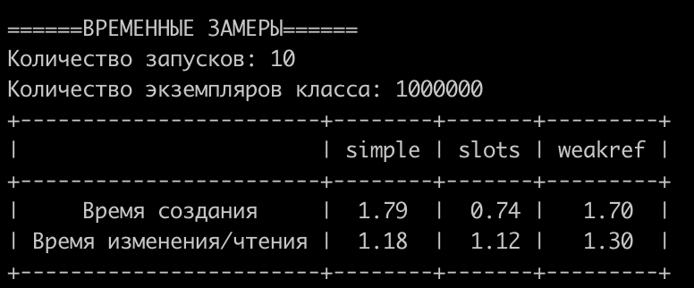
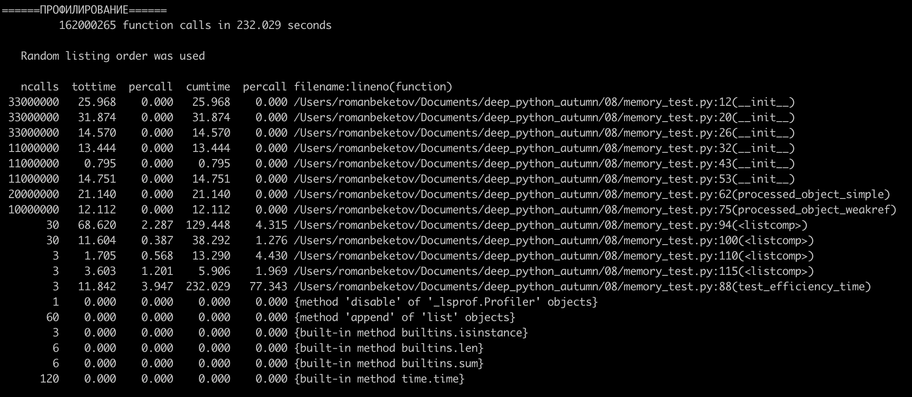
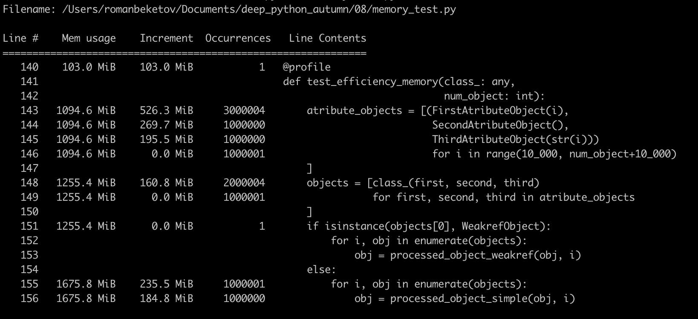
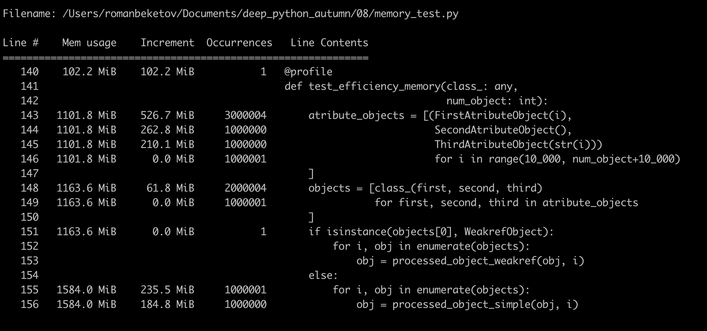

# Отчёт о сравнении использования weakref и слотов
Запуск скрипта:
```
python3 memory_test.py
```

## Временные замеры
Результаты сравнения:


### Вывод:
Использование `__slots__` сократило время создания экземпляров класса более чем в 2 раза. Создание экземпляров класса с обычными атрибутами и с `weakref`'ами выполнилось примерно за одно время. Это можно объяснить тем, что по семантике слабая/сильная ссылка не отличается ничем, кроме добавления единицы в счётчик ссылок на объект, следовательно, и время создания не должно отличаться.

Время изменения/чтения почти что не отличается во всех 3 вариантах. Однако в варианте с `weakref`'ами время изменения/чтения получилось чуть больше, но незначительно, возможно это может быть связано с более "усложнённым" алгоритмом доступа к объекту по ссылке "под капотом" или просто с погрешностью).

## Профилирование вызовов
Результаты:



### Вывод:
Как и ожидалось `__init__` классов атрибутов будет вызван `(количество_запусков*3+3)*10^6` раз, а `__init__` тестируемых классов `(количество_запусков+1)*10^6` раз.
По времени создания (`__init__`) результаты такие же, что и при ручном замере через модуль `time`:
использование `__slots__` сократило время создания экземпляров класса в несколько раз, создание экземпляров класса с обычными атрибутами и с `weakref`'ами выполнилось примерно за одно время.

## Профилирование памяти
Результаты для обычного класса:



Результаты для класса со `__slots__`:



Результаты для класса со `weakref`:


### Вывод
`__slots__` занимают меньше всего памяти ~ 60 Мб
экземпляры класса с обычными атрибутами занимают  ~ 160 Мб
`weakref` занимают больше всего памяти (в несколько раз) ~ 390 Мб