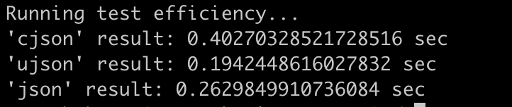

# Подготовка кода
Запустить проект (создать виртуальное окружение с установкой всех необходимых библиотек, компиляция кода и установка модуля, запуск линтеров):
```
make
```
# Запустить unittests и тест производительности
```
make test
```
## Удалить venv
```
make clean
```

# Отчёт о тесте производительности
Результаты сравнения:



## Вывод:
Самой производительной реализацией является `ujson` (быстрее в 2 раза чем `cjson`). Собственная реализация `cjson` (почему-то =[ ) уступает даже стандартной реализации `json`.
